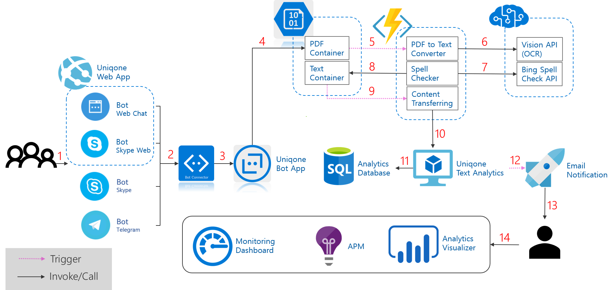

# AnalysisAcquisition

This Project is that gathering and gathering acquisition information in world wide] and analizing risk of it to support optimize decision. 

This Repository has basic sample application to understand system architecture. Another purpose of it is that explain how to utilize azure platform feature to simplify development and composing each of these features.

The overall architecture is focusing on minimize operation and management cost and it has a few of edge-cutting architectural features. and it also using microsoft bot technologies in order to support multiple channels for the customer to send acquisition information into system.

## Architectual Consideration
- Microservices
- Serverless
- Reactive
- Elastic
- Loosely coupled
- Asynchornous IO / Messaging 

*The Most of architectual features are carefully choiced to show and maximize azure platform pros. and cost effectiveness.*

# System Architecture

### FrontEnd: Ingestion Acquistion Information using multiple channels.
- you can see web site source code in this [link](/DevSources/AngularWebDev), and bot app source code in this [link](/DevSources/BotDev).
- Basically, It was configured to using *skype* and *telegram* channel and web site includes two of these. but *email* or *direct line* could be configured if needed.
- *Uniqone Bot app* finally store uploaded file from bot channel into azure blob storage - *PDF Container* . Azure Queue Storage or Service Bus could be used in order to decrease cold start-up time of azure functions.

### Backend: Opticla character recognition & Spell Checking to mitigate recognition error.
- you can find out thehe Source code of it in [link](/DevSources/FunctionAppsDev)
- As PDF File is stored in specified blog storage - *PDF Container*, azure function, [ConvertPdfToTextDocument](/FunctionAppDev/wwwroot/ConvertPdfToTextDocument) would be executed becaused blob storage was specified as triggering event.
- This function converts a image pdf file into multiple image files per pages, and executes Vision APIs in Cognitive Services to recognitize characters in the files. 
- To mitigate OCR recognition error, Bing Spell Check service could be used if needed.
- The function stored composed documents into a specfic blob storage.
- Additionally, SendTextToTextAnalytics function is responsible for sending document to *Uniqone Text Analytics Service*.

This function is using **iTextSharp** nuget package to covert image pdf to multiple image files. you can see the more details of packages in this [link](https://www.nuget.org/packages/iTextSharp/). and a sample source code is [here](https://psycodedeveloper.wordpress.com/2013/01/10/how-to-extract-images-from-pdf-files-using-c-and-itextsharp/).*

*Also, this function is using **Vision APIs** nuget package to using OCR in cognitive service. you can find out the more details are [here](https://www.nuget.org/packages/Microsoft.ProjectOxford.Vision).*

*Azure function supports very easy way to utlize nuget packages using project.json files in azure function root folder. you can find out the how to use it in [project.json](\DevSources\FunctionAppsDev\wwwroot\ConvertPdfToTextDocument\project.json).*

### Analytics: Acquisition information and risks.
-
-

### Monitoring: Application Performance Monitoring.
-
-

### Visualization: Visualization Analyzed Results.
-
-

# Projects Descriptions

# Utilized Technologies
Angular, ASP.NET Core, Bot Framework, App Service(Web App), Azure Functions, Azure Logic App, SQL Database, Power BI, etc.

